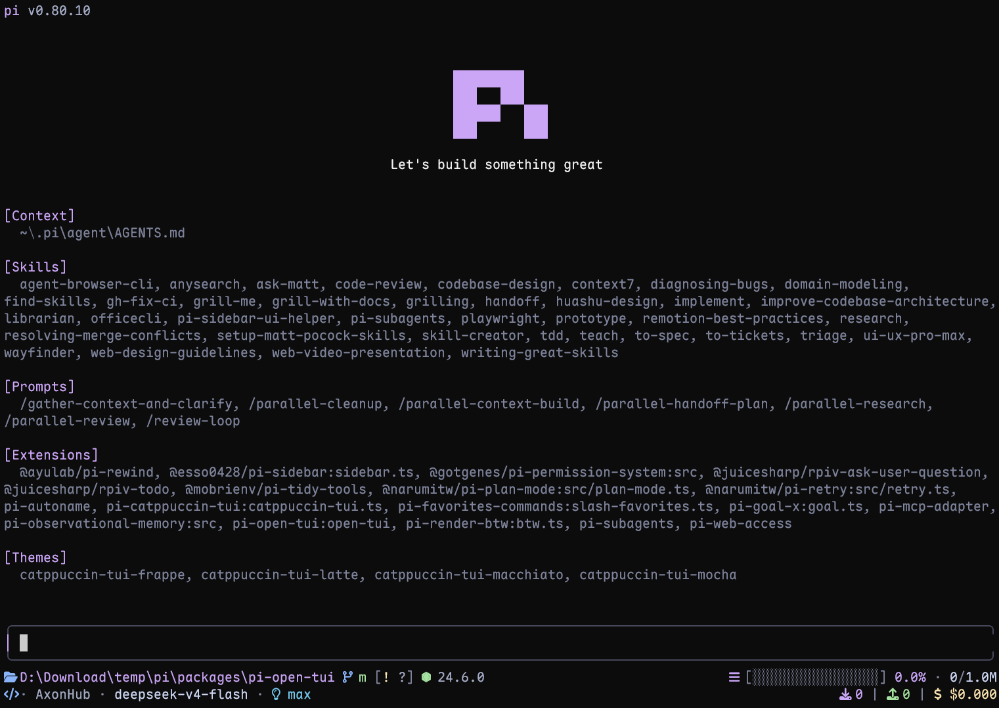

# pi-open-tui

`pi-open-tui` 是一个面向 [Pi](https://pi.dev) coding agent 的终端界面增强扩展。它统一改造 Header、Footer、输入框、消息排版、工具调用、Spinner、全屏滚动和运行统计，让 Pi 的交互与工具展示更接近 Claude Code，同时尽量保持对未知工具和不兼容 Pi 版本的安全回退。



## 核心功能

### 界面与状态栏

- **动态 Pi Logo Header**：16 帧颜色动画和简洁启动标语。
- **Starship 风格 Footer**：两行显示当前目录、会话名、Git 分支与状态、运行环境、上下文占用、Token、缓存、费用、扩展状态和工作计时。
- **全宽输入框**：固定 `❯` 提示符、水平边框、多行对齐，可配置补全菜单向上或向下弹出。
- **图标自动回退**：支持 Nerd Font、ASCII 和自动探测模式。
- **运行环境识别**：识别 Node、Rust、Go、Python、Ruby、Java、Swift、Kotlin、C/C++、Deno、Bun 等常见项目环境。
- **紧凑消息与 Markdown**：压缩用户消息多余背景行，并调整模型输出前缀、Markdown 间距和链接展示。

### Claude 风格工具渲染

- 统一渲染 Pi 内置的 `read`、`write`、`edit`、`bash`、`grep`、`find`、`ls`。
- 支持 MCP 工具，以及 `shell_command`、`apply_patch`、`web_search`、`web_fetch`、task/context 等常见 OpenAI 风格工具。
- 相邻或并发工具调用可合并为一条紧凑状态组。
- `edit`、`write`、`apply_patch` 在参数完整后显示真实 diff 预览。
- Diff 支持统一/左右分栏布局、终端宽度自动选择、增删行和 hunk 统计、词级强调，以及可用时的 Shiki 语法高亮。
- Bash/Shell 执行期间可显示实时尾部预览。
- Read、Search、Bash、MCP、OpenAI 工具结果分别支持 `hidden`、`summary`、`preview` 三种输出策略。
- `Ctrl+O` 继续控制 Pi 原有的工具折叠/展开状态。
- 未识别或不支持的工具自动回退到 Pi 原始 renderer；扩展只改变展示，不替换工具 schema 和执行逻辑。

### Claude 风格 Spinner

- 使用编辑器上方的自定义 Widget 替代 Pi 普通 Working 状态行。
- 跟踪 requesting、thinking、responding、工具参数生成和工具执行阶段。
- 显示运行耗时、provider 上报的输入/输出 Token、Thinking 强度和 stall 状态。
- 支持 reduced motion、详细模式、自定义动词，以及 task/override/suffix 三类扩展事件。
- Pi 的 retry、compaction 和 branch-summary 状态可映射到同一 Spinner；无法兼容时保留原生状态行。

### 全屏模式增强

- 可配置鼠标滚轮每格滚动 1–10 行。
- 用户向上滚动并离开实时输出底部后，在编辑器上方显示 `Jump to bottom (ctrl+End) ↓` 按钮。
- 支持鼠标悬停与点击回到底部，也保留 `Ctrl+End` 键盘操作。

### 统计与扩展能力

- **Turn Telemetry**：每次完整 Agent run 结束后汇总 TPS、TTFT、耗时、输入/输出 Token、stall 和费用速率。
- **自定义 Footer Script**：可用任意可执行脚本完全替换内置 Footer，脚本通过 stdin 接收有界、无敏感信息的 JSON 状态。
- **共享 Spinner Event Bus**：其他扩展可发布任务、主消息覆盖和后缀；[`pi-ask-user-question`](https://github.com/CoderDoubleflower/pi-ask-user-question) 可直接联动。
- **交互式设置**：统一通过 `/open-tui` 管理常规、图标、Spinner、Footer、遥测和工具渲染策略。
- **Claude 风格主题**：附带可选的 `claude-theme` 深色主题。

## 安装

### 环境要求

- Pi `>=0.84.3 <0.85.0`

### 从 GitHub 全局安装

```bash
pi install git:github.com/CoderDoubleflower/pi-open-tui
```

### 仅在当前项目安装

在项目目录中执行：

```bash
pi install -l git:github.com/CoderDoubleflower/pi-open-tui
```

### 更新

```bash
pi update --extensions
```

安装或更新后，重启 Pi，或者执行：

```text
/reload
```

## 快速开始

打开设置界面：

```text
/open-tui
```

设置界面支持英文和简体中文。建议首次使用时检查：

1. General：启用状态、设置语言、补全菜单方向、全屏滚轮速度；选择 `Tool rendering` 可进入工具渲染配置页。
2. Icons：自动、Nerd Font 或 ASCII 图标。
3. Spinner：动画、计时、Token、Thinking、stall、任务事件和自定义动词。
4. Footer：选择需要显示的状态段。
5. Telemetry：选择每轮结束后展示的统计项。

工具渲染配置页可直接设置渲染开关、工具分组、五类工具结果输出策略、预览行数、实时预览和 Diff 显示。所有改动都会立即保存。

安装后可打开 Pi 的：

```text
/settings
```

在主题列表中选择 `claude-theme`。扩展不会自动修改当前主题。

## 配置文件

配置默认保存在：

```text
~/.pi/agent/open-tui.json
```

当前默认结构：

```json
{
  "enabled": true,
  "settingsLanguage": "en",
  "footerScript": null,
  "fullscreen": {
    "wheelScrollLines": 4
  },
  "editor": {
    "dynamicBorderColor": false,
    "autocompleteDirection": "up"
  },
  "icons": {
    "mode": "auto"
  },
  "footerSegments": {
    "cwd": true,
    "sessionName": false,
    "gitBranch": true,
    "gitStatus": true,
    "gitCommit": false,
    "runtime": true,
    "context": true,
    "tokens": true,
    "cost": true,
    "extensionStatuses": true,
    "timer": true
  },
  "telemetry": {
    "enabled": true,
    "tps": true,
    "ttft": true,
    "duration": true,
    "tokens": true,
    "stalls": true,
    "cost": true
  },
  "spinner": {
    "enabled": false,
    "verbose": false,
    "reducedMotion": false,
    "showThinking": true,
    "showTimer": true,
    "showTokens": true,
    "showStall": true,
    "showSuffix": true,
    "effortDisplay": "effective",
    "taskIntegration": "events",
    "suppressFooterWorkingTimer": true,
    "verbs": {
      "mode": "append",
      "values": []
    }
  },
  "toolRendering": {
    "enabled": true,
    "groupToolCalls": true,
    "readOutputMode": "summary",
    "searchOutputMode": "summary",
    "bashOutputMode": "preview",
    "mcpOutputMode": "preview",
    "openAiOutputMode": "preview",
    "previewLines": 8,
    "expandedPreviewMaxLines": 4000,
    "livePreview": true,
    "livePreviewLines": 5,
    "diffCollapsedLines": 24,
    "diffLayout": "auto",
    "diffTheme": "github-dark"
  }
}
```

缺失字段会使用默认值补齐；已知的数值与枚举配置会在加载时归一化。未被当前版本读取的额外字段不会改变扩展行为。

## 工具渲染配置

执行 `/open-tui`，在 `General` 页选择 `Tool rendering`。设置页支持：

- 工具渲染与工具调用分组开关。
- Read、Search、Bash、MCP、OpenAI 输出策略：`hidden`、`summary`、`preview`。
- 折叠预览行数 `1–50`，展开预览上限 `100–20000`。
- 实时预览开关与实时预览行数 `1–20`。
- Diff 折叠行数 `4–200`，以及 `auto`、`unified`、`split` 布局。
- Shiki Diff 主题名，最多 80 个字符。

布尔值和枚举使用 `Enter`/`Space` 切换；数字与主题名会进入单行输入状态。设置会立即写入 `open-tui.json`。关闭分组后，当前已分组的工具组件会立即恢复到 Pi 的普通消息树。旧的 `/open-tui-tools` 命令不再注册。完整设计说明见 [`docs/claude-tool-rendering.md`](docs/claude-tool-rendering.md)。

## Spinner

Spinner 默认关闭，可在 `/open-tui` 的 Spinner 页面开启。默认情况下，运行超过 30 秒后才显示耗时和 Token；启用 `verbose` 后会立即显示。

Token 只使用 provider/Pi 实际上报的：

```text
message.usage.input
message.usage.output
```

插件不会通过流式字符数估算 Token。部分 provider 只在最后一个 stream chunk 返回 usage，因此数值可能在消息结束时一次性更新。

### 自定义动词

`spinner.verbs.mode`：

- `append`：在内置动词后追加自定义动词。
- `replace`：用自定义动词替换内置动词；列表为空时回退到内置动词。

一个 Agent run 只抽样一次动词，期间切换 provider 不会重新抽样。

### Spinner 事件

其他扩展可以通过 Pi Event Bus 发布：

```text
open-tui:spinner:override:v1
open-tui:spinner:tasks:v1
open-tui:spinner:suffix:v1
```

- `override`：替换 Spinner 主消息。
- `tasks`：发布带递增 revision 的完整任务快照，Spinner 会显示第一个 `in_progress` 任务。
- `suffix`：在主消息后追加单行元数据。

每个 provider 使用独立 `source`。清除当前 source 后，会自动恢复之前仍有效的 source；`scope: "agent"` 会在 `agent_end` 自动清理。

示例见 [`examples/spinner-provider.ts`](examples/spinner-provider.ts)。

## Footer 与自定义脚本

内置 Footer 可显示：

- 当前目录和会话名；
- Git 分支、ahead/behind、modified、untracked、staged、stashed；
- detached HEAD 的短 commit hash/tag；
- 项目运行环境；
- 上下文占用、Token、缓存命中、费用和扩展状态；
- Agent 工作时间与最近一次完成耗时。

将 `footerScript` 设置为可执行文件的绝对路径即可完全替换内置 Footer：

```json
{
  "footerScript": "/home/me/.pi/agent/footer.sh"
}
```

脚本必须带有效 shebang 和执行权限。它会从 stdin 收到版本化 JSON，包含终端、时间、会话、模型、上下文、usage、Git、runtime、timer 与扩展状态；原始消息、凭据和环境变量不会传入。

完整示例见 [`examples/open-tui-footer.sh`](examples/open-tui-footer.sh)。

## Turn Telemetry

每个完整 Agent run 结束后，插件会把多个 LLM/tool turn 汇总成一条通知，例如：

```text
TPS 42.5 tok/s | TTFT 1.2s | 29.7s | ↑ 567 | ↓ 1.2k | stall 1x / 4.3s
```

TPS 使用所有 provider 上报的 assistant output Token，除以所有 LLM turn 的生成时间总和；工具执行时间不计入分母。没有 output Token 或可测量生成时间时显示 `TPS —`。

## 兼容性说明

- 扩展主要通过 Pi 的 Header、Footer、Editor 和 Widget API 工作。
- 工具 renderer 只改变显示，不会修改模型面对的工具 schema、参数或执行函数。
- 未识别工具、组件结构变化或兼容桥接失败时采用 fail-open：保留 Pi 原生显示，而不是隐藏状态或工具结果。
- 工具分组、全屏鼠标按钮和部分消息排版需要适配 Pi 0.84.3 的组件结构，因此升级 Pi 大版本后应先运行测试或检查显示效果。
- 非 TUI 模式不会安装交互界面组件。

## 开发

在仓库根目录临时加载：

```bash
pi -e .
```

类型检查与测试：

```bash
npm install
npm run typecheck
npm test
```

## 致谢

本项目吸收了 `pi-haiku`、`pi-claude-code-tui`、`pi-zentui` 和 `pi-tps` 等社区项目的界面与统计思路。

## 许可证

[MIT](LICENSE)
